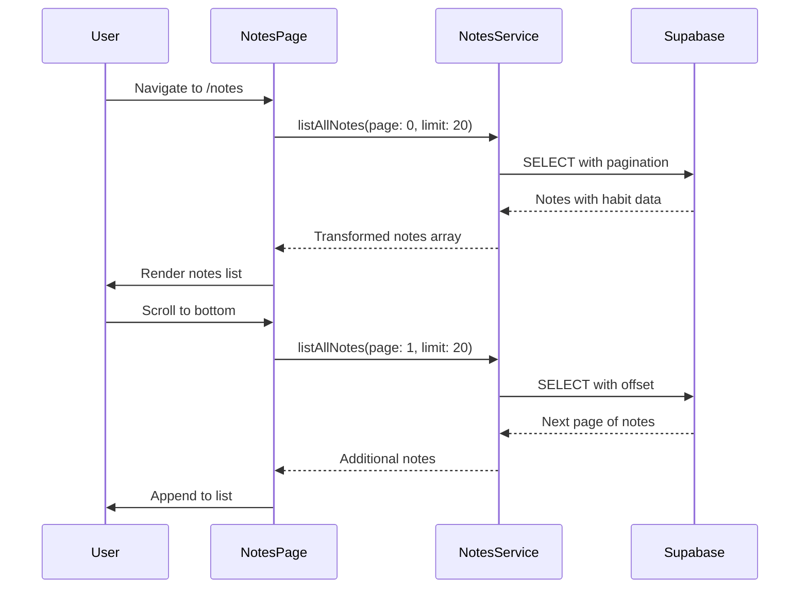

# Design Document: Notes Listing Page

## Overview

The Notes Listing Page is a new feature that provides users with a dedicated view to browse all their notes in a single, scrollable list. The page integrates into the existing navigation structure and displays notes of all types (period notes and occurrence notes) sorted by creation date in descending order. The implementation uses infinite scroll pagination to efficiently load notes as the user scrolls, with visual feedback provided by HeroUI's ScrollShadow component.

## Architecture

The feature follows the existing application architecture patterns:

```
┌─────────────────────────────────────────────────────────────┐
│                        App.tsx                               │
│  ┌─────────────────────────────────────────────────────────┐│
│  │                    Header.tsx                            ││
│  │  [Calendar] [Habits] [Notes] ...                        ││
│  └─────────────────────────────────────────────────────────┘│
│  ┌─────────────────────────────────────────────────────────┐│
│  │                   NotesPage.tsx                          ││
│  │  ┌─────────────────────────────────────────────────────┐││
│  │  │              ScrollShadow Container                  │││
│  │  │  ┌─────────────────────────────────────────────────┐│││
│  │  │  │              NoteListItem                       ││││
│  │  │  │  [Icon] [Title] [Content] [Updated]            ││││
│  │  │  └─────────────────────────────────────────────────┘│││
│  │  │  ┌─────────────────────────────────────────────────┐│││
│  │  │  │              NoteListItem                       ││││
│  │  │  └─────────────────────────────────────────────────┘│││
│  │  │  ...                                                │││
│  │  │  [Loading Indicator / End of List Message]         │││
│  │  └─────────────────────────────────────────────────────┘││
│  └─────────────────────────────────────────────────────────┘│
└─────────────────────────────────────────────────────────────┘
```

### Data Flow



## Components and Interfaces

### New Components

#### NotesPage (`src/pages/NotesPage.tsx`)

- Main page component for the notes listing feature
- Manages pagination state (page number, hasMore, isLoading)
- Handles scroll detection for infinite scroll
- Renders the ScrollShadow container with NoteListItem components

#### NoteListItem (`src/components/note/NoteListItem.tsx`)

- Displays a single note in the list
- Props: `note: NoteWithHabit`
- Renders icon, title, content, and updated timestamp
- Handles both period notes and occurrence notes

### Modified Components

#### Header (`src/components/header/Header.tsx`)

- Add "Notes" navigation button alongside Calendar and Habits
- Apply active state styling when on `/notes` route

#### App (`src/App.tsx`)

- Add route for `/notes` path pointing to NotesPage

### New Service Functions

#### `listAllNotes` (`src/services/notes.service.ts`)

```typescript
type ListAllNotesParams = {
  page: number;
  limit: number;
};

type NoteWithHabit = Note & {
  habit?: Pick<Habit, 'name' | 'iconPath'> | null;
};

const listAllNotes = async (params: ListAllNotesParams): Promise<NoteWithHabit[]>
```

- Fetches paginated notes for the current user
- Joins with occurrences and habits tables for occurrence notes
- Orders by `created_at` descending
- Returns notes with optional habit information

## Data Models

### NoteWithHabit Type

```typescript
// Extended note type that includes habit information for occurrence notes
type NoteWithHabit = Note & {
  habit?: Pick<Habit, 'name' | 'iconPath'> | null;
};
```

### Pagination State

```typescript
type PaginationState = {
  page: number;
  hasMore: boolean;
  isLoading: boolean;
};
```

## Correctness Properties

_A property is a characteristic or behavior that should hold true across all valid executions of a system-essentially, a formal statement about what the system should do. Properties serve as the bridge between human-readable specifications and machine-verifiable correctness guarantees._

Based on the prework analysis, the following properties can be verified through property-based testing:

### Property 1: Notes are sorted by creation date descending

_For any_ set of notes returned by `listAllNotes`, each note's `createdAt` timestamp SHALL be greater than or equal to the `createdAt` timestamp of the subsequent note in the array.
**Validates: Requirements 2.1**

### Property 2: Period note title contains formatted date

_For any_ period note with a valid `periodDate` and `periodKind`, the rendered title SHALL contain a date string derived from the `periodDate`.
**Validates: Requirements 3.1**

### Property 3: Occurrence note title contains habit name

_For any_ occurrence note with an associated habit, the rendered title SHALL contain the habit's `name` property.
**Validates: Requirements 3.2**

### Property 4: Note content is displayed

_For any_ note with non-empty `content`, the rendered note item SHALL contain the exact `content` string.
**Validates: Requirements 3.3**

### Property 5: Note updated timestamp is displayed

_For any_ note with an `updatedAt` timestamp, the rendered note item SHALL contain a formatted representation of that timestamp.
**Validates: Requirements 3.4**

### Property 6: Period note icon matches period kind

_For any_ period note, the rendered icon SHALL correspond to the note's `periodKind` value (day, week, or month).
**Validates: Requirements 3.5**

### Property 7: Pagination appends without replacing

_For any_ sequence of paginated fetches, the accumulated notes list length SHALL equal the sum of all fetched page lengths, and all previously fetched notes SHALL remain in the list.
**Validates: Requirements 4.3**

## Error Handling

### Network Errors

- Display a toast notification when note fetching fails
- Maintain existing notes in the list on fetch failure
- Allow retry by scrolling to bottom again

### Empty State

- Display a friendly message when user has no notes
- Suggest creating notes from the calendar view

### Loading States

- Show spinner at bottom of list while fetching more notes
- Disable scroll-triggered fetching while a fetch is in progress

## Testing Strategy

### Dual Testing Approach

This feature uses both unit tests and property-based tests for comprehensive coverage:

- **Unit tests** verify specific examples, edge cases, and integration points
- **Property-based tests** verify universal properties that should hold across all inputs

### Property-Based Testing

**Library:** fast-check (already available in the project ecosystem via vitest)

**Configuration:** Each property test runs a minimum of 100 iterations.

**Test Annotation Format:** Each property-based test MUST be tagged with:
`**Feature: notes-listing-page, Property {number}: {property_text}**`

### Unit Tests

Unit tests cover:

- Header navigation link rendering and active state
- Route configuration for /notes path
- NoteListItem rendering for different note types
- Empty state and loading state rendering
- Scroll event handling for infinite scroll

### Test Files

- `src/pages/NotesPage.test.tsx` - Page component tests
- `src/components/note/NoteListItem.test.tsx` - List item component tests
- `src/services/notes.service.test.ts` - Service function tests with property tests for sorting
